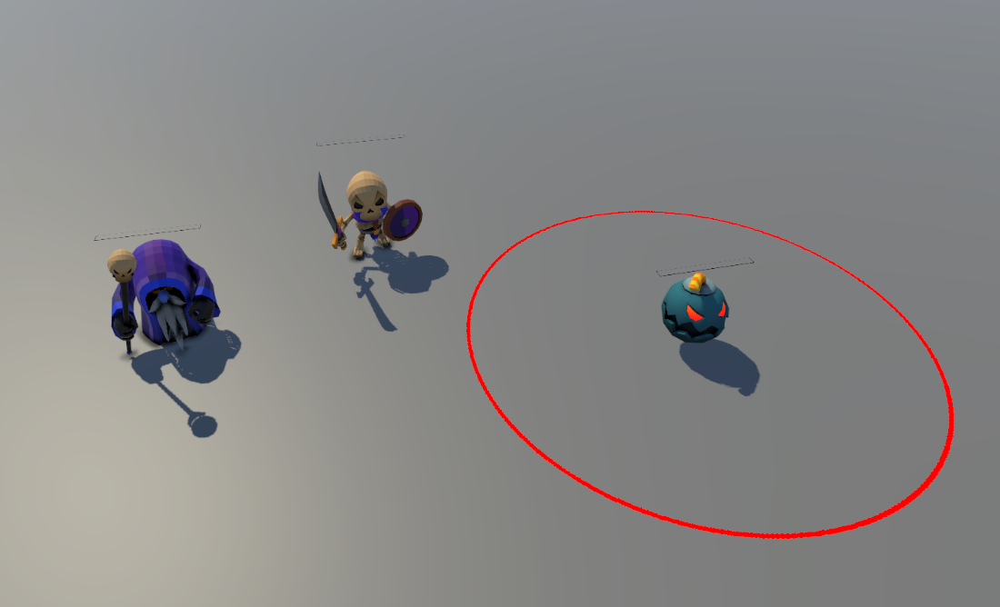

# 3D Enemy AI Framework & UI Health System

This project is a technical C# showcase built in Unity to demonstrate clean code architecture, state-driven AI, and a responsive enemy UI system. 

The main goal was to separate core programming logic from game visuals using a modular **Finite-State Machine (FSM)** and an expandable **Inheritance-based UI System**.

---

## 🛠️ Core Programming Concepts Used

* **State Pattern Architecture:** Replaced long, messy scripts with individual state classes to manage each enemy behavior independently.
* **Object-Oriented Programming (OOP):** Used base classes (`Entity`, `HealthBar`) and polymorphism (method overriding) to easily create different types of enemies and custom UI logic.
* **Data-Driven Design:** Used Unity `ScriptableObjects` (`D_Entity`) to store enemy stats (like speed and detection range) outside the scripts, making it easy to balance the game without touching the code.

---

## 🚀 AI & UI System Breakdown

<p align="center">
  
  <br>
  <em>In-engine preview of the AI variants and UI systems in action.</em>
</p>

### ⚔️ 1. Melee Vanguard (Skeleton)
* **Idle & Detection:** Starts in a stationary idle/standby state, remaining in place while monitoring the environment until the player enters its defined `agroRange`.
* **Target Chasing:** Once triggered, it transitions smoothly into a pursuit behavior, tracking the player's position to execute conditional attacks (`E1_MeleeAttackState`, `E1_ChargeAttackState`).
* **Stun Interrupt:** Instantly stops what it is doing and enters a stun state (`E1_StunState`) when hit, unless it is currently in the middle of an active attack animation frame.

### 💣 2. Kamikaze Agent (Bomb)
* **Chasing Target:** Locks onto the player's position and chases them down using custom NavMesh overrides.
* **Explosion Telegraph:** Calculates the distance to the player to trigger a red warning circle indicator (`explodeIndicator`) right before self-detonation.

### 🔮 3. Ranged Caster (Mage)
* **Approach Logic:** Monitors player proximity vectors. If the player is spotted, it moves forward until it reaches its designated combat/firing range.
* **Stationary Attack:** Once within range, it stops moving and stands ground to execute its casting routine, dealing damage from a distance.
* **Projectile Pipeline:** Couples distance checks with a dedicated projectile spawning pipeline (`projectilePrefab`) to control projectile initialization, velocity vectors, and trajectory setups.

### 📊 4. Smooth Billboard Health System
* **Ease Lerp Effect (`HealthBar.cs`):** Features a double-slider system. When an enemy takes damage, the main bar drops instantly, while a secondary background bar catches up smoothly using `Mathf.Lerp` for a satisfying visual effect.
* **Billboard Rotation (`EnemyHealthBar.cs`):** The health bar automatically calculates the vector from itself to the `MainCamera` every frame, ensuring the 2D UI always faces the player perfectly in 3D space.

---

## 📂 Repository Structure

```text
📂 Scripts
├── 📂 Data SO
│   └── 📄 D_Entity.cs             # ScriptableObject managing base attributes for all enemies
├── 📂 EnemyScript                 # Specific enemy logic clusters and state machines
│   ├── 📂 Bomb                    # Kamikaze movement and self-detonation states (Enemy2)
│   ├── 📂 Mage                    # Ranged approach, positioning, and spell casting states (EnemyMage)
│   ├── 📂 Skeleton                # Melee standby, chasing, and hit-stun states (Enemy1)
│   ├── 📂 State                   # Sub-state definitions tailored for individual entities
│   ├── 📄 AnimToEntity.cs         # Animation events acting as bridges between Animator and FSM
│   └── 📄 GenerateEnamy.cs        # Spawner system and runtime manager logic
├── 📂 FSM
│   ├── 📄 EnemyState.cs           # Base state class with lifecycle loops (Enter, Exit, Update)
│   ├── 📄 EnemyStateMachine.cs    # Core engine that handles switching between states
│   └── 📄 Entity.cs               # Abstract base class blueprint for all AI entities
├── 📂 HealthBar
│   ├── 📄 HealthBar.cs            # Base UI handler managing dynamic sliders and smooth Lerp tracking
│   └── 📄 EnemyHealthBar.cs       # Derived UI class adding camera-facing billboard rotation
└── 📂 projectileScripts           # Projectile displacement vectors and hit registration math
